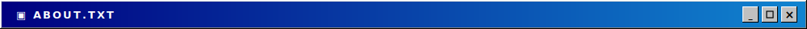
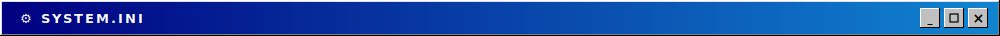
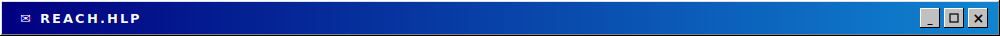
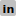
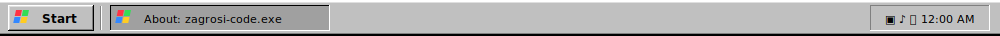

**[user]** &nbsp; zagrosi-code

**[role]** &nbsp; AI Product Engineer

**[companies]** &nbsp;  One City Global &nbsp;·&nbsp;  Starling Bank

 

**[languages]** &nbsp;  TypeScript &nbsp;·&nbsp;  Python &nbsp;·&nbsp;  Java &nbsp;·&nbsp;  Haskell &nbsp;·&nbsp;  Solidity

**[frameworks]** &nbsp;  React &nbsp;·&nbsp;  Next.js &nbsp;·&nbsp;  Node.js &nbsp;·&nbsp;  Tailwind &nbsp;·&nbsp;  Prisma

**[data]** &nbsp;  PostgreSQL &nbsp;·&nbsp;  GraphQL &nbsp;·&nbsp;  SQL

**[cloud / ops]** &nbsp;  AWS &nbsp;·&nbsp;  Azure &nbsp;·&nbsp;  Docker &nbsp;·&nbsp;  Terraform &nbsp;·&nbsp;  Actions &nbsp;·&nbsp;  Vercel

 

**[socials]** &nbsp;  [linkedin.com/in/zgrs](https://linkedin.com/in/zgrs) ↗

 

